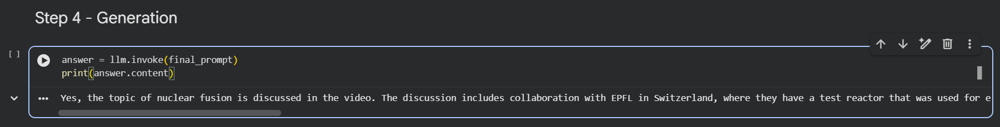
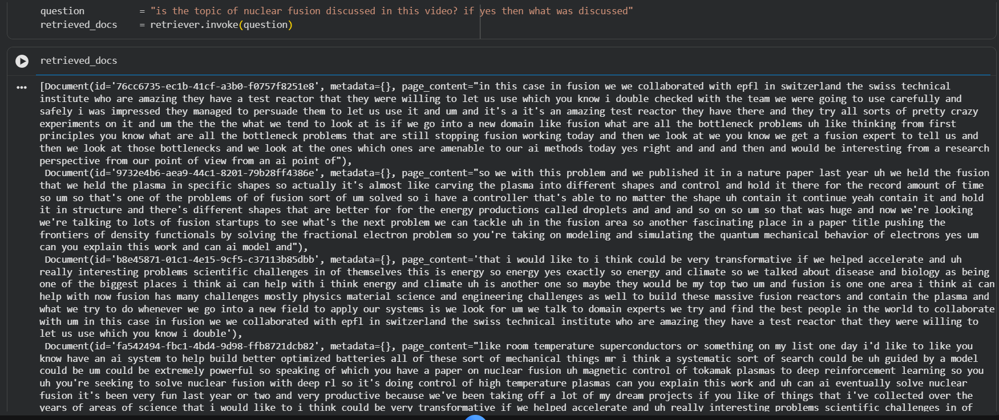
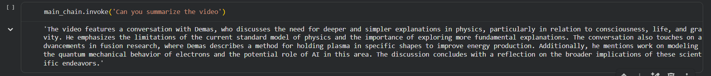

# YouTube RAG Chatbot

A Retrieval-Augmented Generation (RAG) chatbot that answers user questions based on the transcript of a YouTube video. The project extracts video transcripts, converts them into embeddings, stores them in a FAISS vector database, retrieves the most relevant transcript chunks, and generates accurate answers using OpenAI's GPT-4o Mini model.

## Features

* Extracts transcripts directly from YouTube videos
* Splits large transcripts into manageable chunks
* Generates vector embeddings using OpenAI Embeddings
* Stores embeddings in a FAISS vector database
* Retrieves the most relevant transcript sections for a query
* Generates context-aware answers using GPT-4o Mini
* Implements a complete Retrieval-Augmented Generation (RAG) pipeline
* Built using LangChain's modular architecture

## Tech Stack

* Python
* LangChain
* OpenAI GPT-4o Mini
* OpenAI Embeddings (`text-embedding-3-small`)
* FAISS Vector Store
* YouTube Transcript API

## Project Workflow

1. Transcript Extraction

   * Fetch transcript from a YouTube video using YouTube Transcript API.

2. Text Splitting

   * Split transcript into overlapping chunks using RecursiveCharacterTextSplitter.

3. Embedding Generation

   * Convert text chunks into vector embeddings using OpenAI Embeddings.

4. Vector Storage

   * Store embeddings inside a FAISS vector database.

5. Retrieval

   * Retrieve the most relevant transcript chunks based on the user's query.

6. Augmentation

   * Inject retrieved context into a prompt template.

7. Generation

   * Generate answers using GPT-4o Mini.

## Architecture

```text
YouTube Video
      ↓
Transcript Extraction
      ↓
Text Chunking
      ↓
OpenAI Embeddings
      ↓
FAISS Vector Store
      ↓
Similarity Search
      ↓
Prompt Augmentation
      ↓
GPT-4o Mini
      ↓
Final Answer
```

## Screenshots

### Question Answering



*Example of the chatbot answering questions using retrieved transcript context.*

### Retrieval Step



*Relevant transcript chunks retrieved from the FAISS vector database.*

### Video Summarization



*Automatic summarization of video content using the complete RAG pipeline.*

## Installation

```bash
git clone https://github.com/Yash-Raj-Ravi/youtube-rag-chatbot.git
cd youtube-rag-chatbot

pip install -r requirements.txt
```

## Environment Variables

Set your OpenAI API key before running the notebook:

```bash
export OPENAI_API_KEY="your_api_key_here"
```

## Usage

1. Open the notebook in Google Colab or Jupyter Notebook.
2. Set the YouTube video ID.
3. Run all cells.
4. Ask questions related to the video.
5. The chatbot retrieves relevant transcript sections and generates grounded responses.

## Example Queries

* Can you summarize the video?
* Who is Demis?
* What is DeepMind?
* Is nuclear fusion discussed in this video?
* What are the key takeaways from the video?

## Sample Output

**Question:**

```text
Is nuclear fusion discussed in this video?
```

**Answer:**

```text
Yes, nuclear fusion is discussed in the video. The speaker explains ...
```

## Future Improvements

* Support multiple YouTube videos
* Playlist-level question answering
* Source citations in responses
* Streamlit/Gradio web interface
* Conversation memory
* Hybrid search (semantic + keyword search)

## Repository Structure

```text
youtube-rag-chatbot/
│
├── youtube_chatbot_rag.ipynb
├── requirements.txt
├── README.md
└── screenshots/
    ├── chatbot_answer.png
    ├── retrieval.png
    └── summary.png
```

## Author

**Yash Raj Ravi**
B.Tech – Artificial Intelligence and Data Engineering
Indian Institute of Information Technology (IIIT) Kota
